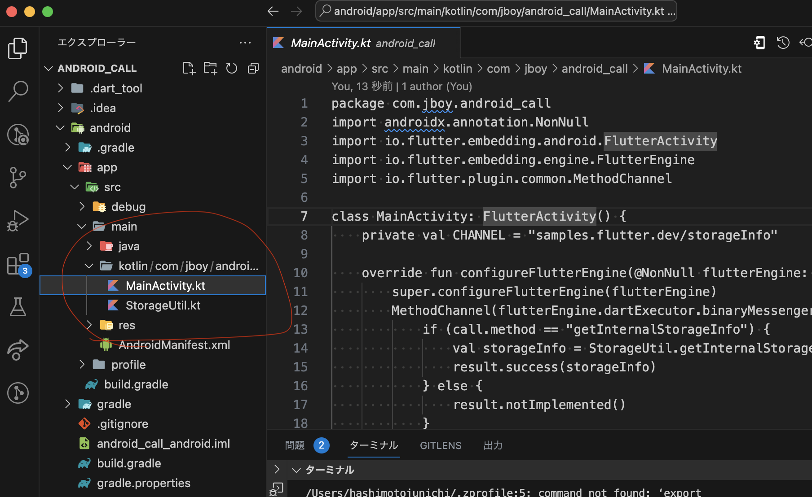
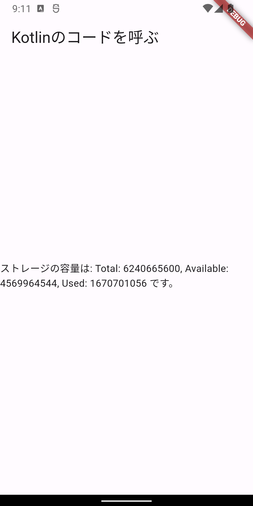

# KotlinのコードをFlutterから呼び出す
Androidのネイティブのコードを呼ぶ方法

android/app/src/main/kotlinというKotlinのコードが書かれているフォルダに、
StorageUtil.ktというファイルを作成し、以下のコードを記述する。



このコードは、内部ストレージの情報を取得するコードである。

```kotlin
import android.os.Environment
import android.os.StatFs

object StorageUtil {
    fun getInternalStorageInfo(): String {
        val statFs = StatFs(Environment.getDataDirectory().path)
        val blockSize = statFs.blockSizeLong
        val totalBlocks = statFs.blockCountLong
        val availableBlocks = statFs.availableBlocksLong

        val totalSize = blockSize * totalBlocks
        val availableSize = blockSize * availableBlocks
        val usedSize = totalSize - availableSize

        return "Total: $totalSize, Available: $availableSize, Used: $usedSize"
    }
}
```

MainActivity.ktに以下のコードを追加する。
追加すると、Android端末の内部ストレージの情報がFlutterで表示される。
Flutterがビルドしたときに、MainActivity.ktを見つけるには、package名を合わせる必要がある。
今回だと、com.jboy.android_callというpackage名になっているので、
MainActivity.ktのpackage名もcom.jboy.android_callにする。

```kotlin
package com.jboy.android_call
import androidx.annotation.NonNull
import io.flutter.embedding.android.FlutterActivity
import io.flutter.embedding.engine.FlutterEngine
import io.flutter.plugin.common.MethodChannel

class MainActivity: FlutterActivity() {
    private val CHANNEL = "samples.flutter.dev/storageInfo"

    override fun configureFlutterEngine(@NonNull flutterEngine: FlutterEngine) {
        super.configureFlutterEngine(flutterEngine)
        MethodChannel(flutterEngine.dartExecutor.binaryMessenger, CHANNEL).setMethodCallHandler { call, result ->
            if (call.method == "getInternalStorageInfo") {
                val storageInfo = StorageUtil.getInternalStorageInfo()
                result.success(storageInfo)
            } else {
                result.notImplemented()
            }
        }
    }
}
```

成功すると、FlutterでKotlinのコードを呼び出すことができるようになる。
